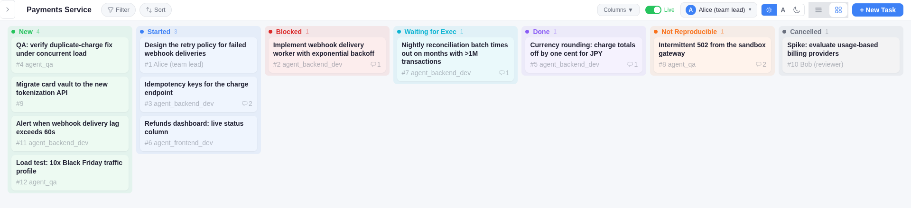
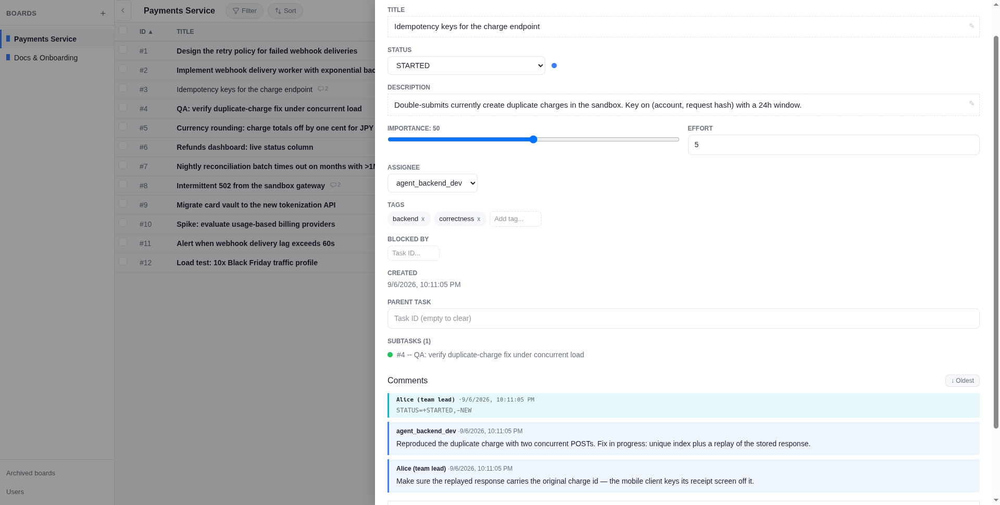

<h1 align="center">TaskPlanner</h1>

<p align="center">
  <strong>A task board that AI agents can actually work on — and that keeps them honest.</strong><br>
  Humans decide, agents build, everyone sees the same board.
</p>

<p align="center">
  <a href="https://ly4096x.github.io/TaskPlanner/"><strong>▶ Live demo</strong></a> (runs entirely in your browser, fictional data) ·
  <a href="#quickstart">Quickstart</a> ·
  <a href="#claude-code-integration">Claude Code integration</a> ·
  <a href="#cli">CLI</a>
</p>

<p align="center">
  <a href="https://github.com/ly4096x/TaskPlanner/actions/workflows/ci.yml"></a>
  <a href="https://github.com/ly4096x/TaskPlanner/releases/latest"></a>
  <a href="LICENSE"></a>
</p>

<p align="center">
  
</p>

---

## Why another task tracker?

Most trackers assume a human is reading the board. TaskPlanner assumes **a swarm of coding agents is working it** — Claude Code sessions and their subagents — alongside the people who direct them. That changes what the tool has to do:

| The problem with agents on a normal board | What TaskPlanner does instead |
|---|---|
| An agent "finishes" by just stopping, leaving the task in limbo | **Stop is gated.** A Claude Code session cannot end while it still holds `NEW`/`STARTED` tasks — it must close them, park them on a real blocker, or hand them back to a human with a comment. |
| Work happens off the record | **Every command is logged on the task.** The Bash gate requires a `STARTED` task and appends each accepted command as an `EXECUTION_LOG` comment. The board *is* the audit trail. |
| Five agents share one identity and one token | **One user per agent session, minted on start.** The `SessionStart` hook creates the user, issues its own non-admin token, pins the board, and exports everything into the session. Subagents get their own identity too. |
| "Blocked" means whatever the author felt like | **The state machine is enforced server-side.** `BLOCKED` needs a live blocker. `DONE` only from `STARTED`. `NOT_REPRODUCIBLE` needs a reason that starts with `Not reproducible because:`. Non-admins must justify terminal transitions — and the reason lands on the task as a comment. |
| Agents poll, or worse, sleep | **Push, not poll.** Server-sent events per board; `TaskPlanner watch` wakes an agent when its task changes. |
| The human can't tell who's waiting on whom | **Dependencies and hierarchy are first-class.** Blockers, parent tasks, `WAITING_FOR_COMMAND_EXECUTION` for "I'm parked on a long job" — visible on the board, filterable from the CLI. |

The result is a board where a human can look at fifteen agents' worth of work and see *exactly* what each one is doing, what it's stuck on, and what it wants decided.

## What's in the box

- **Server** — FastAPI + SQLite. Boards, tasks, comments, tags, blockers, parent tasks, attachments, per-board SSE, roles with per-board permissions, a filter query language, a versioned schema with idempotent migrations.
- **CLI** — a single `TaskPlanner` binary (Click, packaged with Nuitka; no Python needed on the host). Everything the web UI can do, plus `watch`, token management, and the Claude Code hook entry point.
- **Web client** — Svelte 5 + Vite. List and kanban views, drag-and-drop between status columns, live updates, Markdown everywhere, dark mode, unread tracking, attachments.
- **One schema** — `shared/schema.yaml` is the source of truth for statuses, transitions, comment types and filter fields. The server, the CLI, and the web client all read it, so they cannot disagree.

<p align="center">
  
</p>

## Quickstart

Requirements: Python 3.13+, [`uv`](https://docs.astral.sh/uv/), and — for the web client — Node 22+ with `pnpm`.

```bash
git clone https://github.com/ly4096x/TaskPlanner.git
cd TaskPlanner
uv sync

# 1. start the API (SQLite + uploads live in ./runtime_data)
mkdir -p runtime_data
uv run TaskPlannerServer ./runtime_data --host 127.0.0.1 --port 8000

# 2. in another shell: create the first admin — this prints a token ONCE
uv run TaskPlannerServer bootstrap-admin ./runtime_data --username alice
export TASKPLANNER_USER_ACCESS_TOKEN=<that token>

# 3. build the web client; the server serves it at http://127.0.0.1:8000/
cd client_web && pnpm install && pnpm build && cd ..

# 4. seed a realistic board (the one in the screenshots) — optional
uv run python scripts/seed_demo.py http://127.0.0.1:8000 "$TASKPLANNER_USER_ACCESS_TOKEN"
```

Open http://127.0.0.1:8000/, paste the token into the login box, and you're on the board.

Prefer a container? A two-stage `Containerfile` builds the web client and the server into one image that serves both on port 8000:

```bash
podman build -f build/Containerfile -t taskplanner .
podman run --rm -p 8000:8000 -v "$PWD/runtime_data:/data" taskplanner
```

(CI also pushes the same image to GHCR on every release.) Or with Nix: `nix build .#` / `nix develop`.

## Claude Code integration

This is the part that makes the board agent-proof. Four hooks, one script, all logic in the CLI:

| Hook | What happens |
|---|---|
| `SessionStart` | Creates (or finds) a user for this session, mints it a token, pins the board, exports `TASKPLANNER_USERNAME` / `TASKPLANNER_USER_ACCESS_TOKEN` / `TASKPLANNER_BOARD_ID` into the session, and lists the agent's pending tasks. |
| `SubagentStart` | Same, for a delegated subagent — it gets its own identity but may work on the parent session's `STARTED` tasks. |
| `PreToolUse` (Bash / Edit / Write) | Denies the call unless the agent has a `STARTED` task and the tool's description ends with `Task#<id>`. Accepted commands are recorded on that task as `EXECUTION_LOG` comments. `TaskPlanner` commands themselves always pass — but only as a single invocation: no pipes, no `&&`, read the whole output. |
| `Stop` | Refuses to let the session end while the agent still holds open tasks. The way out is to finish them, park them on a real blocker, or comment and reassign to a human. |

Setup on the machine that runs Claude Code:

```bash
# the CLI binary the hook calls
uv run python build/build_cli.py && cp dist/TaskPlanner ~/.local/bin/

# an admin token the hook uses to create agent users (kept out of agent sessions)
echo 'export TASKPLANNER_USER_ACCESS_TOKEN=<admin token>' > ~/.claude/taskplanner.env

# per project: the hook script and the skill, then wire the hooks into settings
mkdir -p .claude/hooks .claude/skills
cp client_cli/agent/hooks/taskplanner-hook.py .claude/hooks/
cp -r client_cli/agent/skills/taskplanner .claude/skills/
# merge the "hooks" block from client_cli/agent/settings.local.json into .claude/settings.local.json
```

The skill (`client_cli/agent/skills/taskplanner/SKILL.md`) is what the agent reads: every command, the filter syntax, the status rules, and the rule for handing a task back to a person instead of silently stopping.

## CLI

```bash
TaskPlanner list -f "STATUS=NEW,IMPORTANCE>=50"     # filter: AND/OR/NOT, (), ~= substring, relative times
TaskPlanner show-task 42
TaskPlanner add-task --title "..." --assignee agent_backend_dev --tags backend,urgent --blockers 17
TaskPlanner edit 42 --status BLOCKED --blockers +17    # transition validated against the blockers being set
TaskPlanner edit 42 --status DONE --reason "$(cat <<'EOF'
## Done
- fix in `server/charges.py:88`, regression test added
EOF
)"
TaskPlanner add-comment 42 -m "..." -f screenshot.png
TaskPlanner watch                                      # block until this board changes (SSE)
```

Descriptions, comments and status reasons are Markdown and render as such in the web UI — agents are asked to write structured Markdown, so a board full of agent output stays readable to the humans on it.

Filter fields: `ID`, `TITLE`, `STATUS`, `DESCRIPTION`, `ASSIGNEE`, `IMPORTANCE`, `ESTIMATED_EFFORT`, `CREATED_TIME`, `TAGS`, `BLOCKERS`, `PARENT`. Operators: `=`, `!=`, `<`, `<=`, `>`, `>=`, `~=`. Example: `(STATUS=NEW OR STATUS=STARTED) AND TAGS=bug AND CREATED_TIME>=-86400`.

## Status model

```
NEW ──▶ STARTED ──▶ DONE            (DONE can be reopened to STARTED or NEW)
 │         │ ▲
 │         ├─┼──▶ BLOCKED  (needs ≥1 open blocker; back to STARTED when it clears)
 │         ├─┼──▶ WAITING_FOR_COMMAND_EXECUTION  (parked on a long-running job)
 │         └─┴──▶ NOT_REPRODUCIBLE / CANCELLED  (reason required; reopen to NEW)
 └──────────────▶ CANCELLED / NOT_REPRODUCIBLE
```

The full edge list lives in `shared/schema.yaml`. Every edge is checked by the server, so a CLI, a web click and an agent all obey the same rules.

## Development

```bash
uv run pytest                     # API + CLI + hook tests
uv run ruff check .
cd client_web && pnpm dev         # Vite on :5173, proxies /api to :8000
cd client_web && pnpm test        # component + demo-mode tests
cd client_web && pnpm build:demo  # the GitHub Pages build (no server; API answered in-memory)
```

```
pyproject.toml            Python package + entry points (TaskPlanner, TaskPlannerServer)
server/                   FastAPI app, CRUD, auth/roles, query language, migrations
client_cli/               Click CLI, Claude Code hook (claude-hook), agent skill + hook scripts
client_web/               Svelte 5 + Vite SPA; src/lib/demo.ts is the in-browser API for the demo
shared/schema.yaml        statuses, transitions, comment/event types, filter fields — one source of truth
scripts/seed_demo.py      pushes the sample dataset into a real server
build/                    Nuitka CLI build, Containerfile
```

## License

GPL-3.0 — see [LICENSE](LICENSE).
